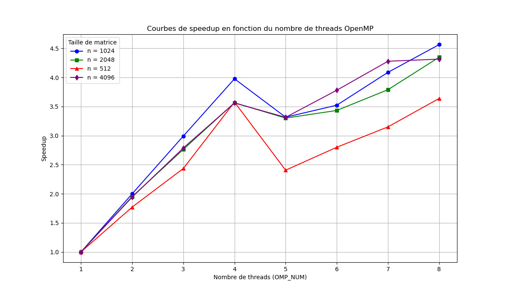

# TD1

pandoc -s --toc README.md --css=./github-pandoc.css -o README.html

## lscpu

lscpu donne des infos utiles sur le processeur : nb core, taille de cache :

CPU(s): 8
L1d: 128 KiB
L1i: 128 KiB
L2: 1 MiB
L3: 6 MiB

## Produit matrice-matrice

### Effet de la taille de la matrice

  n             | MFlops
----------------|--------
    1023        | 318.134
 1024 (origine) | 100.936 
    1025        | 351.231

Assosiative Cache, les adresses sont modulo 1024. Quand la taille de la matrice est 1024 les access sont toujour sur le meme cache ce qui cause beaucoup de cache miss. Lorsque la taille est 1023 ou 1025, les accès se font dans d'autres caches, ce qui entraîne une réduction du nombre cache miss.

### Permutation des boucles

Le programme est compilé avec les options suivantes : -O2 -march=native -Wall
Avec -O2, le compilateur effectue déjà certaines optimisations de boucle et d'accès à la mémoire, de sorte que certaines différences entre les permutations de i, j, k peuvent être réduites. << march=native >> indique au compilateur d'utiliser des instructions vectorielles spécifiques au processeur. 

make TestProduct.exe && ./TestProduct.exe 1024

  ordre           | time    | MFlops  | MFlops(n=2048)
------------------|---------|---------|----------------
i,j,k (origine)   | 21.0573 | 101.983 |
j,i,k             | 11.9821 | 179.224 |
i,k,j             | 20.7077 | 103.704 |
k,i,j             | 25.8191 | 83.1742 |
j,k,i             | 0.84630 | 2537.49 |
k,j,i             | 0.88315 | 2431.60 |

Nous pouvons constater que les deux dernières permutations (j,k,i et k,j,i) sont beaucoup plus rapides que les autres. La raison principale en est l'accès contigu aux éléments en mémoire (à la fois la matrice résultante C et des parties de A et B, en fonction de la structure de la boucle).

En C, les matrices sont généralement stockées en rang majeur. Pour un accès plus efficace, nous voulons que l'index qui varie le plus rapidement (dans la boucle la plus interne) soit celui qui correspond aux éléments contigus dans la memoire.

### OMP sur la meilleure boucle

make TestProduct.exe && OMP_NUM_THREADS=8 ./TestProduct.exe 1024

  OMP_NUM         | MFlops  | MFlops(n=2048) | MFlops(n=512)  | MFlops(n=4096)
------------------|---------|----------------|----------------|---------------
1                 | 2524.45 |     2535.89    |     3041.90    |    2432.65
2                 | 5047.93 |     4948.22    |     5386.46    |    4727.03
3                 | 7553.88 |     7007.35    |     7406.20    |    6778.23
4                 | 10039.3 |     9039.65    |     10877.6    |    8662.38
5                 | 8372.30 |     8371.32    |     7316.96    |    8062.65
6                 | 8893.75 |     8704.65    |     8517.05    |    9197.43
7                 | 10319.6 |     9610.44    |     9582.24    |    10408.7
8                 | 11522.9 |     11024.9    |     11068.2    |    10498.1

En analysant le speedup, nous voyons qu'en général il y a un gain presque linéaire jusqu'à 4 threads, ce qui démontre une bonne scalabilité. Cependant, à partir d'un certain point (5, 6, 7, 8 threads), des effets de << overhead >> apparaissent. Malgré ça, le gain global est significatif.

### Produit par blocs

make TestProduct.exe && ./TestProduct.exe 1024

 szBlock | MFlops   | MFlops(n=2048) | MFlops(n=512) | MFlops(n=4096) 
---------|----------|----------------|---------------|----------------
 32      | 2399.60  | 1195.91        | 2030.00       | 843.40         
 64      | 2763.65  | 1696.49        | 2801.04       | 1178.88        
 128     | 3485.58  | 2443.72        | 2207.25       | 1710.31        
 256     | 2909.75  | 3061.90        | 1861.71       | 2496.30        
 512     | 2347.05  | 2719.68        | 1272.68       | 3121.05        
 1024    | 1363.23  | 1803.47        | 1054.24       | 2686.33        

Pour n = 512, la taille de bloc 64 permet d'obtenir les meilleures performances ; pour n = 1024, le meilleur resultat est obtenu avec le bloc 128 ; pour n = 2048, le bloc 256 est le plus rapide ; pour n = 4096, c'est le bloc 512 qui se distingue.

Cela montre qu'il n'y a pas de taille de bloc optimale universelle. Au fur et à mesure que la taille de la matrice augmente, des blocs plus grands peuvent augmenter la reutilisation des données dans le cache jusqu'à un certain point.

Le blocage permet de conserver des blocs plus petits de A et B dans la mémoire cache tout en multipliant des sous-blocs de C. De cette façon, on perd moins de temps à accéder à la mémoire principale (RAM). Cependent, les gros blocs peuvent gaspiller la mémoire cache ou ne pas s'y intégrer correctement, pendant que les très petits blocs augmentent le travail des boucles.

### Bloc + OMP

  szBlock      | OMP_NUM | MFlops  | MFlops(n=2048) | MFlops(n=512)  | MFlops(n=4096)|
---------------|---------|---------|----------------|----------------|---------------|
1024           |  1      | 2544.63 | 2429.42        |                | 2458.9        |
1024           |  8      | 2505.76 | 4668.96        |                | 9038.52       |
512            |  1      | 2386.67 | 2425.72        | 3034.95        | 2543.1        |
512            |  8      | 4885.82 | 9090.83        | 3051.01        | 11336.4       |

Avec szBlock = 1024 et 1 thread nous obtenons 2544 MFlops pour n=1024, ce qui est pratiquement la même chose que de ne pas utiliser le blocage, parce que en pratique szBlock=1024 est un bloc unique pour la matrice entière. Avec 8 threads, les performances augment considérablement (par exemple, 4668,96 ou 9038,52 MFlops). Cela suggere que, même << overhead >>, la distribution du travail entre plusieurs noyaux apporte un gain significatif.

Avec szBlock = 512, 1 thread atteint 2386 MFlops (légèrement en dessous de 1024), mais avec 8 threads il peut atteindre plus de 9000 ou 11000 MFlops en fonction de la taille de la matrice. Cela montre que l'effet de blocage peut bien interagir avec le parallélisme quand la taille des blocs est mieux adaptée au cache de chaque noyau.

En général, chaque configuration (taille des blocs, nombre de threads, ordre des boucles) doit être testée, car il existe un compromis entre la réutilisation des données dans le cache et le << overhead >> de parallélisme.

### Comparaison avec BLAS, Eigen et numpy

 algo          | MFlops  | MFlops(n=2048) | MFlops(n=512)  | MFlops(n=4096)|
---------------|---------|----------------|----------------|---------------|
Bloc + OMP     | 4885.82 | 9090.83        | 3051.01        | 11336.4       |
BLAS           | 2593.95 | 2559.51        | 3147.52        |  2506.5       |

Pour n = 2048 et n = 4096, la version Block + OMP surpasse la version BLAS. En revanche, pour n = 512, BLAS obtient un meilleur résultat, probablement parce que les bibliothèques BLAS sont très bien optimisées pour les matrices de taille relativement << moyenne/petite >>.
