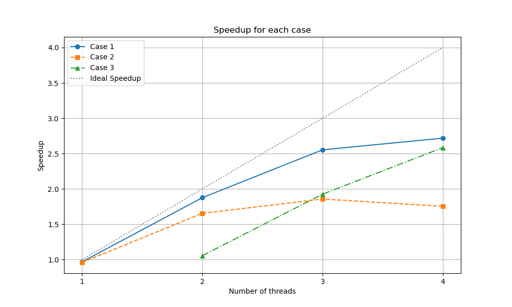
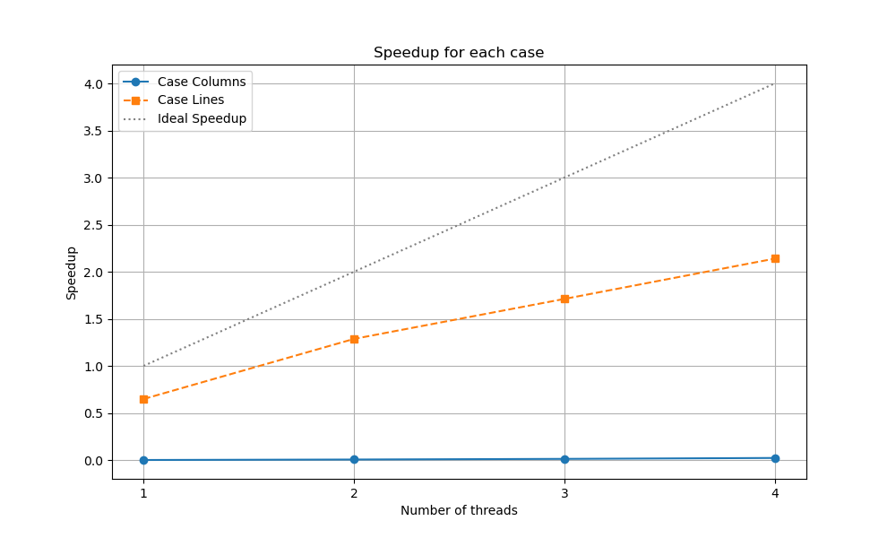

# TD n° 2 - 27 Janvier 2025

##  1. Parallélisation ensemble de Mandelbrot

L'ensensemble de Mandebrot est un ensemble fractal inventé par Benoit Mandelbrot permettant d'étudier la convergence ou la rapidité de divergence dans le plan complexe de la suite récursive suivante :
$$
\begin{cases}
c \text{ é um valor complexo dado} \\
z_0 = 0 \\
z_{n+1} = z_n^2 + c
\end{cases}
$$
dépendant du paramètre $c$.

Il est facile de montrer que si il existe un $N$ tel que $\mid z_{N} \mid > 2$, alors la suite $z_{n}$ diverge. Cette propriété est très utile pour arrêter le calcul de la suite puisqu'on aura détecter que la suite a divergé. La rapidité de divergence est le plus petit $N$ trouvé pour la suite tel que $\mid z_{N} \mid > 2$.

On fixe un nombre d'itérations maximal $N_{\textrm{max}}$. Si jusqu'à cette itération, aucune valeur de $z_{N}$ ne dépasse en module 2, on considère que la suite converge.

L'ensemble de Mandelbrot sur le plan complexe est l'ensemble des valeurs de $c$ pour lesquels la suite converge.

Pour l'affichage de cette suite, on calcule une image de $W\times H$ pixels telle qu'à chaque pixel $(p_{i},p_{j})$, de l'espace image, on associe une valeur complexe  $c = x_{min} + p_{i}.\frac{x_{\textrm{max}}-x_{\textrm{min}}}{W} + i.\left(y_{\textrm{min}} + p_{j}.\frac{y_{\textrm{max}}-y_{\textrm{min}}}{H}\right)$. Pour chacune des valeurs $c$ associées à chaque pixel, on teste si la suite converge ou diverge.

- Si la suite converge, on affiche le pixel correspondant en noir
- Si la suite diverge, on affiche le pixel avec une couleur correspondant à la rapidité de divergence.

1. À partir du code séquentiel `mandelbrot.py`, faire une partition équitable par bloc suivant les lignes de l'image pour distribuer le calcul sur `nbp` processus  puis rassembler l'image sur le processus zéro pour la sauvegarder. Calculer le temps d'exécution pour différents nombre de tâches et calculer le speedup. Comment interpréter les résultats obtenus ?

| p   | Tp (s) | Speedup = 1.3805 / Tp |
|-----|-------------------|-----------------------------------|
| 1   | 1.4256            | 0.9684                            |
| 2   | 0.7357            | 1.877                             |
| 3   | 0.5406            | 2.553                             |
| 4   | 0.5078            | 2.720                             |

- Le speedup pour **p=4** atteint environ **2,72**, ce qui est le meilleur parmi tous les cas testés.
- Pour **p=1**, le temps (1.4256) est légèrement supérieur au temps séquentiel (1.3805), ce qui s'explique par la surcharge d’initialisation et de communication inhérente à un code parallélisé.
- L'évolution du speedup (1,88 pour p=2, 2,55 pour p=3 et 2,72 pour p=4) montre une évolutivité raisonnable jusqu'à 4 processus.

2. Réfléchissez à une meilleur répartition statique des lignes au vu de l'ensemble obtenu sur notre exemple et mettez la en œuvre. Calculer le temps d'exécution pour différents nombre de tâches et calculer le speedup et comparez avec l'ancienne répartition. Quel problème pourrait se poser avec une telle stratégie ?

| p   | Tp (s) | Speedup = 1.3805 / Tp |
|-----|-------------------|-----------------------------------|
| 1   | 1.4383            | 0.9600                            |
| 2   | 0.8340            | 1.656                             |
| 3   | 0.7432            | 1.857                             |
| 4   | 0.7868            | 1.755                             |

- Bien qu'annoncée comme « améliorée », les résultats montrent que **les temps ne sont pas meilleurs** par rapport au Cas 1.
- Pour **p=4**, le temps augmente (0.7868 contre 0.5078 dans le Cas 1), conduisant à un speedup de seulement **1,75** (au lieu de 2,72).
- Explication possible : Il est possible que l'estimation de la complexité de chaque ligne n'ait pas été correcte, ce qui signifie que les processus qui ont reçu des lignes plus « faciles » ont pris trop de temps.

3. Mettre en œuvre une stratégie maître-esclave pour distribuer les différentes lignes de l'image à calculer. Calculer le speedup avec cette approche et comparez  avec les solutions différentes. Qu'en concluez-vous ?

| p   | Tp (s) | Speedup = 1.3805 / Tp |
|-----|-------------------|-----------------------------------|
| 1   | None              | --                                |
| 2   | 1.3077            | 1.056                             |
| 3   | 0.7168            | 1.927                             |
| 4   | 0.5341            | 2.586                             |

- Pour **p=2**, le temps (1.3077) est juste un peu meilleur que le séquentiel (speedup ~1,06). Le gain reste donc modeste, suggérant que la surcharge de distribution dynamique ne compense pas pour un faible nombre de processus.
- À partir de **p=3** et **p=4**, le speedup devient plus significatif (1,93 et 2,59), dépassant les performances du Cas 2, mais **restant légèrement en dessous** de celles du Cas 1 pour p=4 (2,59 vs 2,72).
- Cependant, l'approche maître-esclave prend tout son sens dans les cas de charges de calcul variables ou quand le nombre de processus augmente, car la distribution dynamique peut éviter les goulots d'étranglement dans les zones plus coûteuses à calculer.

## 2. Produit matrice-vecteur

On considère le produit d'une matrice carrée $A$ de dimension $N$ par un vecteur $u$ de même dimension dans $\mathbb{R}$. La matrice est constituée des cœfficients définis par $A_{ij} = (i+j) \mod N$. 

Par soucis de simplification, on supposera $N$ divisible par le nombre de tâches `nbp` exécutées.

### a - Produit parallèle matrice-vecteur par colonne

Afin de paralléliser le produit matrice–vecteur, on décide dans un premier temps de partitionner la matrice par un découpage par bloc de colonnes. Chaque tâche contiendra $N_{\textrm{loc}}$ colonnes de la matrice. 

- Calculer en fonction du nombre de tâches la valeur de Nloc
- Paralléliser le code séquentiel `matvec.py` en veillant à ce que chaque tâche n’assemble que la partie de la matrice utile à sa somme partielle du produit matrice-vecteur. On s’assurera que toutes les tâches à la fin du programme contiennent le vecteur résultat complet.
- Calculer le speed-up obtenu avec une telle approche

### b - Produit parallèle matrice-vecteur par ligne

Afin de paralléliser le produit matrice–vecteur, on décide dans un deuxième temps de partitionner la matrice par un découpage par bloc de lignes. Chaque tâche contiendra $N_{\textrm{loc}}$ lignes de la matrice.

- Calculer en fonction du nombre de tâches la valeur de Nloc
- paralléliser le code séquentiel `matvec.py` en veillant à ce que chaque tâche n’assemble que la partie de la matrice utile à son produit matrice-vecteur partiel. On s’assurera que toutes les tâches à la fin du programme contiennent le vecteur résultat complet.
- Calculer le speed-up obtenu avec une telle approche

## 3. Entraînement pour l'examen écrit

Alice a parallélisé en partie un code sur machine à mémoire distribuée. Pour un jeu de données spécifiques, elle remarque que la partie qu’elle exécute en parallèle représente en temps de traitement 90% du temps d’exécution du programme en séquentiel.

En utilisant la loi d’Amdhal, pouvez-vous prédire l’accélération maximale que pourra obtenir Alice avec son code (en considérant n ≫ 1) ?
   
La loi d’Amdahl indique que l’accélération $S_{\text{Amdahl}}(n)$ en fonction de $n$ processeurs (ou nœuds) est:
   $$
   S_{\text{Amdahl}}(n) \;=\; \frac{1}{(1 - p) + \frac{p}{n}},
   $$
   où :
   - $p$ est la fraction du code qui peut être parallélisée

Lorsque $n$ tend vers l’infini, la partie $\frac{p}{n}$ tend vers 0. Ainsi :
   $$
   S_{\text{Amdahl}}(\,n \to \infty\,)
   \;=\;
   \frac{1}{1 - p}
   \;=\;
   \frac{1}{1 - 0{,}9}
   \;=\;
   \frac{1}{0{,}1}
   \;=\;
   10.
   $$

L’accélération maximale théorique est donc **10**.

À votre avis, pour ce jeu de donné spécifique, quel nombre de nœuds de calcul semble-t-il raisonnable de prendre pour ne pas trop gaspiller de ressources CPU ?

**Estimation pour plusieurs valeurs de $n$**  
- Pour $n = 8$ :
    $$
    S(8) \;=\; \frac{1}{\,0{,}1 + \frac{0{,}9}{8}\,}
    \approx \frac{1}{0{,}1 + 0{,}1125}
    \approx 4{,}7.
    $$
- Pour $n = 16$ :
    $$
    S(16) \;=\; \frac{1}{\,0{,}1 + \frac{0{,}9}{16}\,}
    \approx \frac{1}{0{,}1 + 0{,}05625}
    \approx 6{,}4.
    $$
- Pour $n = 32$ :
    $$
    S(32) \;=\; \frac{1}{\,0{,}1 + \frac{0{,}9}{32}\,}
    \approx \frac{1}{0{,}1 + 0{,}028125}
    \approx 7{,}8.
    $$
- Pour $n = 64$ :
    $$
    S(64) \;=\; \frac{1}{\,0{,}1 + \frac{0{,}9}{64}\,}
    \approx \frac{1}{0{,}1 + 0{,}0140625}
    \approx 8{,}8.
    $$
 
On voit que le speedup progresse encore lorsque $n$ augmente, mais les gains supplémentaires deviennent moins significatifs au-delà de quelques dizaines de nœuds.

Approcher 8 ou 9 de speedup peut déjà être considéré comme proche de la valeur limite (10), et doubler encore le nombre de nœuds ne ferait que gagner 1 ou 2 points d’accélération.

En effectuant son cacul sur son calculateur, Alice s’aperçoit qu’elle obtient une accélération maximale de quatre en augmentant le nombre de nœuds de calcul pour son jeu spécifique de données.

En doublant la quantité de donnée à traiter, et en supposant la complexité de l’algorithme parallèle linéaire, quelle accélération maximale peut espérer Alice en utilisant la loi de Gustafson ?

 
On sait que, pour un certain nombre de nœuds $n$, le programme subit une accélération de 4.

Selon la loi de Gustafson :
$$
S_{\text{Gustafson}}(n) = (1 - p) + p \times n,
$$
où $p$ représente la fraction de calcul parallélisable **telle qu’observée** pour la taille de données donnée.

Obtenir un speedup de 4 signifie :
$$
(1 - p) + p\,n = 4.
$$

En doublant la quantité de donnée à traiter la partie séquentielle $T_s$ reste (quasiment) la même et la partie parallélisable $T_p$ double (car elle croit linéairement avec la taille des données).

Par conséquent, la nouvelle fraction parallélisable $p'$ est plus grande que $p$.

Pour la nouvelle taille de données, la fraction parallélisable passe à $p'$, donc, le speedup avec un grand nombre de nœuds peut alors se réévaluer.  

En pratique, il se trouve (en appliquant la formule complète et en étudiant la fraction séquentielle inchangée) que le nouveau maximum possible (lorsqu’on laisse à nouveau $n$ croître, ou qu’on choisit un nombre de nœuds assez grand) est d’environ **7**.